Homework 6, Linear Models
================
Emil Hafeez (eh2928)
11/23/2020

# Problem One

Read in and tidy.

``` r
homicide_df = 
  read_csv("data/homicide.csv", na = c("", "NA", "Unknown")) %>% 
  mutate(
    city_state = str_c(city, state, sep = ", "),
    victim_age = as.numeric(victim_age),
    resolution = case_when(
      disposition == "Closed without arrest" ~ 0,
      disposition == "Open/No arrest"        ~ 0,
      disposition == "Closed by arrest"      ~ 1)
  ) %>% 
  filter(
    victim_race %in% c("White", "Black"),
    !city_state %in% c("Tulsa, AL", "Dallas, TX", "Phoenix, AZ", "Kansas City, MO")) %>% 
  select(city_state, resolution, victim_age, victim_race, victim_sex)
```

Start with a regression for just one city, Baltimore, MD. Observe the
estimate and the lower and upper confidence intervals of the adjusted
odds ratio for solvign homicides comparing Blsck victims to white
victims.

``` r
baltimore_df =
  homicide_df %>% 
  filter(city_state == "Baltimore, MD")

baltimore_fit = glm(resolution ~ victim_age + victim_race + victim_sex, 
    data = baltimore_df,
    family = binomial()) 

baltimore_fit %>% 
  broom::tidy() %>% 
  mutate(
    OR = exp(estimate),
    CI_lower = exp(estimate - 1.96 * std.error),
    CI_upper = exp(estimate + 1.96 * std.error)
  ) %>% 
  select(term, OR, starts_with("CI")) %>% 
  knitr::kable(col.names =
                c("Variable", "Odds Ratio Estimate", "Lower CI", "Upper CI"),
              align = "cccc", 
              digits = 3
              )
```

|     Variable      | Odds Ratio Estimate | Lower CI | Upper CI |
| :---------------: | :-----------------: | :------: | :------: |
|    (Intercept)    |        1.363        |  0.975   |  1.907   |
|    victim\_age    |        0.993        |  0.987   |  1.000   |
| victim\_raceWhite |        2.320        |  1.648   |  3.268   |
|  victim\_sexMale  |        0.426        |  0.325   |  0.558   |

Now, let’s run this GLM across multiple cities (all of the 47
remaining), and similarly extract the adjusted odds ratio (and CI) for
solving homicides comparing Black victims to white victims. We do this
tidily, using purr::map, list columns, and unnesting.

``` r
models_results_df = 
  homicide_df %>% 
  nest(data = -city_state) %>% 
  mutate(
    models = 
      map(.x = data, ~glm(resolution ~ victim_age + victim_race + victim_sex, data = .x, family = binomial())),
    results = map(models, broom::tidy)
  ) %>% 
  select(city_state, results) %>% 
  unnest(results) %>% 
  mutate(
    OR = exp(estimate),
    CI_lower = exp(estimate - 1.96 * std.error),
    CI_upper = exp(estimate + 1.96 * std.error)
  ) %>% 
  select(city_state, term, OR, starts_with("CI")) 
```

Now, let’s plot the resultant ORs and CIs of the logistic regression.

``` r
models_results_df %>% 
  filter(term == "victim_raceWhite") %>% 
  mutate(city_state = fct_reorder(city_state, OR)) %>% 
  ggplot(aes(x = city_state, y = OR)) + 
  geom_point() + 
  geom_errorbar(aes(ymin = CI_lower, ymax = CI_upper)) + 
  geom_hline(yintercept = 1, color = "red") +
  theme(axis.text.x = element_text(angle = 45, vjust = 1, hjust = 1)) +
  scale_y_continuous(breaks = seq(0, 30, 5)) +
  labs(
    title = "Fig. 1: Estimates of the OR for Solving Homicides in US Cities",
    x = "City",
    y = "Odds Ratio Estimate, with CI Bars",
    caption = "Homework 6: Odds Ratio for Solving Homicides where Victim is White (vs reference: Black), Holding Age and Binary Gender Constant")
```


The results show that in many US cities of the 47 for which data are
available, the odds of a homicide case ending in arrest are greater when
the victim is white compared to Black, holding age of the victim and
gender (binary) constant. While there is variability in these estimated
which often overlaps the null hypothesis value of OR = 1, many estimates
are above 1, and many cities have CIs above 1 which do not overlap the
null. This is another modern example of racial injustice in our judicial
system, for even if arrest and incarceration is not an effective
solution, the apparent racial disparity of whose victims find “justice”
as defined by our criminal system feels like yet another example of who
is prioritized in our society.

# Problem Two

Load and tidy the birthweight data for model fitting. Includes changing
converting numeric to factor, and selecting to remove the empty/missing
data variables.

``` r
birthweight_df = 
  read_csv("data/birthweight.csv") %>% 
  mutate(
    babysex = as.factor(babysex),
    frace = as.factor(frace),
    mrace = as.factor(mrace)
  ) %>% # seeing as these factor labels stay in the same order as the data dictionary, regression interpretation will fall along the same lines, and so I leave this as-is rather than add labels and manually order in terms of fct_infreq() or something similar
  ungroup() %>% 
  select(bwt, babysex, bhead, blength, gaweeks, malform, ppbmi, ppwt, delwt, wtgain, mheight, momage, mrace, menarche, frace, fincome, parity, pnumlbw, pnumsga, smoken) %>% 
  select(-pnumlbw, -pnumsga)
```

We took a quick look.

``` r
summary(birthweight_df)

birthweight_df %>% 
  ggplot(aes(x = bwt)) + 
  geom_histogram()
```

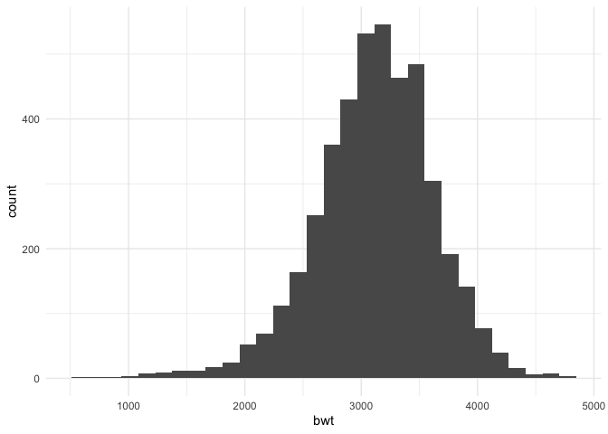

``` r
birthweight_df %>% 
  ggplot(aes(x = bhead, y = bwt)) + 
  geom_point()
```

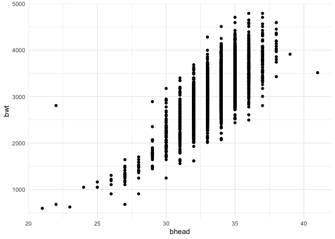

Now, fit a regression model and plot the model residuals against fitted
values, using the original data frame. We’ll scale this into the
cross-validated approach.

``` r
birthweight_df =
  birthweight_df %>% 
  mutate(
    bhead_cp = (bhead > 28) * (bhead - 28)
  )

fit = lm(bwt ~ bhead + blength + blength*bhead + babysex + smoken + fincome + momage + bhead_cp, data = birthweight_df)
summary(fit)
```

    ## 
    ## Call:
    ## lm(formula = bwt ~ bhead + blength + blength * bhead + babysex + 
    ##     smoken + fincome + momage + bhead_cp, data = birthweight_df)
    ## 
    ## Residuals:
    ##      Min       1Q   Median       3Q      Max 
    ## -1171.44  -189.63    -4.98   178.69  2539.96 
    ## 
    ## Coefficients:
    ##                 Estimate Std. Error t value Pr(>|t|)    
    ## (Intercept)   -4600.1719   809.3745  -5.684 1.41e-08 ***
    ## bhead            53.1767    24.5339   2.167 0.030253 *  
    ## blength         206.6642    25.9617   7.960 2.17e-15 ***
    ## babysex2         40.3878     8.7709   4.605 4.25e-06 ***
    ## smoken           -1.6707     0.5855  -2.853 0.004348 ** 
    ## fincome           1.1593     0.1758   6.595 4.75e-11 ***
    ## momage            4.4355     1.1766   3.770 0.000166 ***
    ## bhead_cp        276.3438    31.4889   8.776  < 2e-16 ***
    ## bhead:blength    -3.6232     0.7777  -4.659 3.28e-06 ***
    ## ---
    ## Signif. codes:  0 '***' 0.001 '**' 0.01 '*' 0.05 '.' 0.1 ' ' 1
    ## 
    ## Residual standard error: 283.1 on 4333 degrees of freedom
    ## Multiple R-squared:  0.6951, Adjusted R-squared:  0.6945 
    ## F-statistic:  1235 on 8 and 4333 DF,  p-value: < 2.2e-16

``` r
AIC(fit)
```

    ## [1] 61359.99

Plots, including the model residuals vs fitted values

``` r
birthweight_df %>% 
  add_residuals(fit) %>% 
  add_predictions(fit) %>% 
  ggplot(aes(x = pred, y = resid, alpha = 0.1, color = "blue")) + 
  geom_point()
```

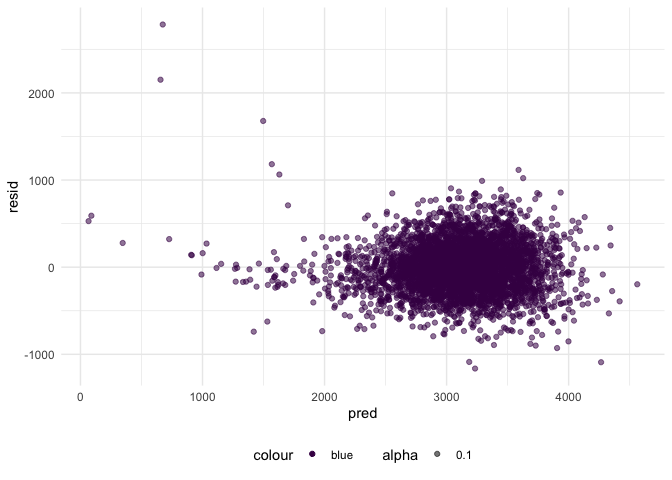

``` r
birthweight_df %>% 
  add_residuals(fit) %>% 
  add_predictions(fit) %>% 
  ggplot(aes(x = resid), alpha = 0.1) + 
  geom_density()
```

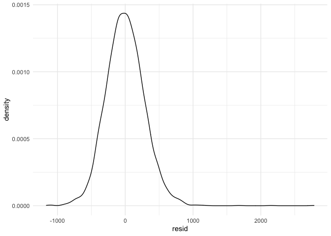

``` r
birthweight_df %>% 
  add_residuals(fit) %>% 
  add_predictions(fit) %>% 
  ggplot(aes(x = bwt, y = resid, alpha = 0.1, color = "red")) + 
  geom_point()
```

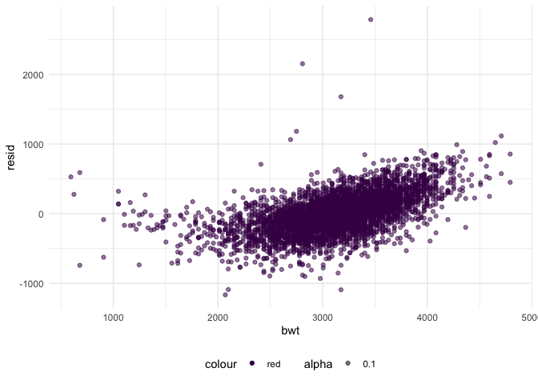
Let me briefly comment on model construction. My approach was primarily
driven by a hypothesized structure for the factors that underlie
birthweight.

I first examined a histogram of birthweight and noticed that there are
very low birthweights in the sample, not likely due to data collection
errors but more to troubling and dangerous circumstances. By first
determining that the data may not follow a linearly predictable trend
for the whole birthweight distribution, I used the lecture example to
make a simple cutpoint, and added it to concepts which (as a lay person)
struck me as relevant to the birthweight outcome; I considered variables
from the most proximal of factors (e.g. head circumference and body
length) to more distal (e.g. income as a proxy for pre-birth structural
and resource factors that may influence birthweight). Then, I applied
this to information I obtained by comparing the two given models and
included an interaction term. Then, I tested this model, and can see
from the above plots from the Predictions versus Residuals plot that
while the predictions for lower birthweight (and high) do appear less
consistent than for the middle density of the data, and there are one or
two outliers (see \~3500 grams), it may still be appropriate for the
bulk of the data. Then, I compared this model’s predictors coefficients,
adjusted R-squared, and AIC to the given models, and decided to proceed.

Let’s compare the models. First, generate the cross validation
dataframe.

``` r
cv_df = 
  crossv_mc(birthweight_df, 100)
#test if it's working
#cv_df %>% pull(train) %>% .[[1]] %>% as_tibble
```

Now, can we create three functions mapped over each of the
cross-validation resample objects? Let’s also store the RMSE.

``` r
cv_df = 
  cv_df %>% 
  mutate(
    simple_model  = map(train, ~lm(bwt ~ bhead + gaweeks, data = .x)),
    pw_model = map(train, ~lm(bwt ~ bhead + blength + blength*bhead + babysex + smoken + fincome + momage + bhead_cp, data = .x)),
    complex_model  = map(train, ~lm(bwt ~ bhead + blength + babysex + bhead*blength + bhead*babysex + blength*babysex +  bhead*blength*babysex, data = .x))) %>% 
  mutate(
    rmse_simple = map2_dbl(simple_model, test, ~rmse(model = .x, data = .y)),
    rmse_pw = map2_dbl(pw_model, test, ~rmse(model = .x, data = .y)),
    rmse_complex = map2_dbl(complex_model, test, ~rmse(model = .x, data = .y)))
```

Let’s also plot the RMSEs for each model to compare them based on RMSE.

``` r
cv_df %>% 
  select(starts_with("rmse")) %>% 
  pivot_longer(
    everything(),
    names_to = "model", 
    values_to = "rmse",
    names_prefix = "rmse_") %>% 
  mutate(model = fct_inorder(model)) %>% 
  ggplot(aes(x = model, y = rmse)) + 
  geom_violin() +
  scale_y_continuous(breaks = seq(0, 500, 50)) +
  labs(
    title = "RMSE for Model Selection",
    x = "Model",
    y = "RMSE",
    caption = "Homework 6: RMSE for three models explaining variation in infant birthweight")
```

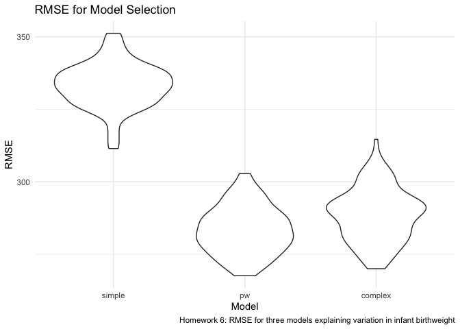

How about plotting the data?

``` r
simple_model  = lm(bwt ~ bhead + gaweeks, data = birthweight_df)
pw_model = lm(bwt ~ bhead + blength + blength*bhead + babysex + smoken + fincome + momage, data = birthweight_df)
complex_model  = lm(bwt ~ bhead + blength + babysex + bhead*blength + bhead*babysex + blength*babysex + bhead*blength*babysex, data = birthweight_df)


birthweight_df %>% 
  gather_predictions(simple_model, pw_model, complex_model) %>% 
  mutate(model = fct_inorder(model)) %>% 
  ggplot(aes(x = bhead, y = bwt)) + 
  geom_point(alpha = 0.5) + 
  geom_line(aes(y = pred), color = "red", group = 1) + 
  facet_wrap(~model)
```

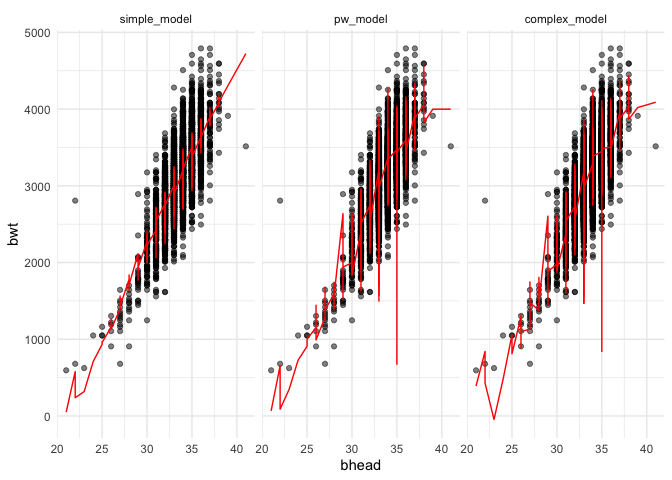

# Problem Three

First, we’ve imported the data.

Let’s fit the model, with tmax as the response and tmin as the
predictor.

``` r
the_right_fit = lm(tmax ~ tmin, data = weather_df)
summary(the_right_fit)
```

    ## 
    ## Call:
    ## lm(formula = tmax ~ tmin, data = weather_df)
    ## 
    ## Residuals:
    ##     Min      1Q  Median      3Q     Max 
    ## -6.0304 -2.1245  0.0264  1.7264  9.4915 
    ## 
    ## Coefficients:
    ##             Estimate Std. Error t value Pr(>|t|)    
    ## (Intercept)  7.20850    0.22635   31.85   <2e-16 ***
    ## tmin         1.03924    0.01699   61.16   <2e-16 ***
    ## ---
    ## Signif. codes:  0 '***' 0.001 '**' 0.01 '*' 0.05 '.' 0.1 ' ' 1
    ## 
    ## Residual standard error: 2.938 on 363 degrees of freedom
    ## Multiple R-squared:  0.9115, Adjusted R-squared:  0.9113 
    ## F-statistic:  3741 on 1 and 363 DF,  p-value: < 2.2e-16

Let’s just take a look.

``` r
weather_df %>% 
  ggplot(aes(x = tmin, y = tmax)) + 
  geom_point(aes(alpha = .5, color = tmin)) +
  stat_smooth(method = "lm", se = F)
```

    ## `geom_smooth()` using formula 'y ~ x'

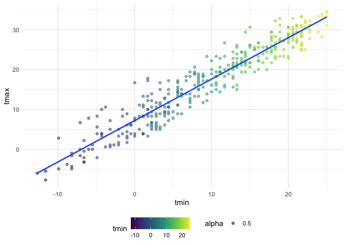

``` r
weather_df %>% 
  add_residuals(the_right_fit) %>% 
  add_predictions(the_right_fit) %>% 
  ggplot(aes(x = resid), alpha = 1) + 
  geom_density(color = "red")
```

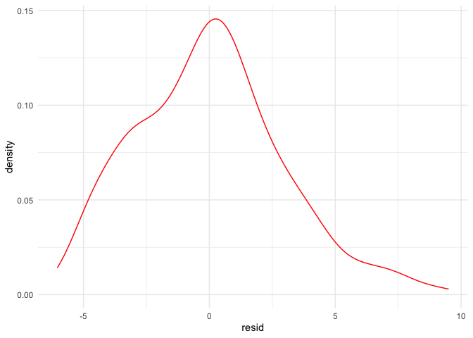

Let’s compute the two values now, within a bootstrap.

Can we jump right into bootstrap?

``` r
bootstrap_sim = 
  weather_df %>% 
  bootstrap(n = 5000) %>%
  mutate(
    models = map(strap, ~lm(tmax ~ tmin, data = .x)),
    results = map(models, broom::tidy),
    glanced = map(models, broom::glance)
    ) %>% 
  select(-strap, -models) %>% 
  unnest(c(results, glanced), names_repair = "unique") %>% 
  select(.id, term, estimate, r.squared) %>% 
  mutate(
    term = str_replace(term, "\\(Intercept\\)", "intercept")
  ) %>% 
  pivot_wider(
    names_from = term,
    values_from = estimate
  ) %>% 
  mutate(
    transform = log(intercept * tmin),
    .id = as.numeric(.id)
  ) %>% 
  select(-intercept, -tmin)
```

Let’s plot these.

``` r
bootstrap_sim %>% 
  ggplot(aes(x = r.squared)) +
  geom_density() +
  scale_x_continuous(breaks = seq(0.87, 0.94, 0.01)) +
  labs(
    title = "Bootstrapped Estimates of R-Squared",
    x = "R-Squared Estimate",
    y = "Density",
    caption = "R-squared Value for Max Temp as Function of Min Temp")
```

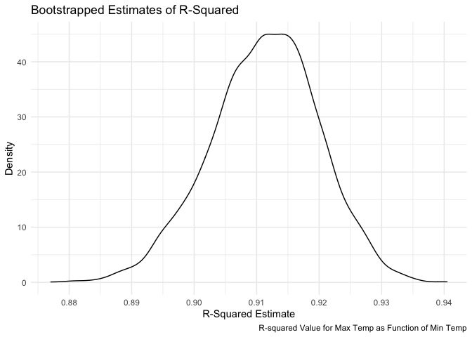

``` r
bootstrap_sim %>% 
  summary(r.squared)
```

The bootstrapped estimate of the r-squared value follows a slightly
left-skewed distribution, with a mean of 0.9113 and median of 0.9116.
Values range from 0.8771 to 0.9405 (quite a high r-squared value).

``` r
bootstrap_sim %>% 
  ggplot(aes(x = transform)) +
  geom_density() +
  labs(
    title = "Bootstrapped Estimates of Transformed Coefficients Combination",
    x = "Transformation Estimate",
    y = "Density",
    caption = "5000-sample Estimate of Log Transformed B1*B2")
```

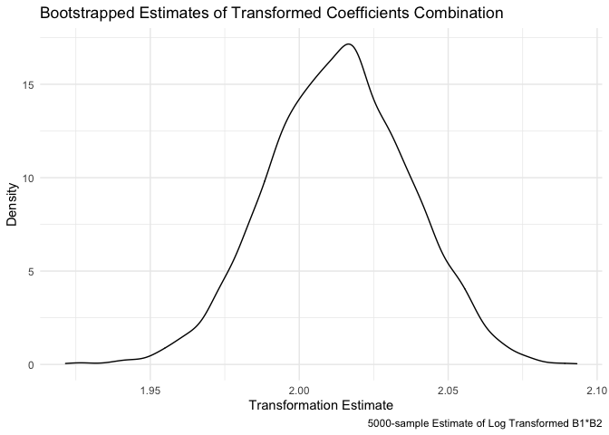

``` r
bootstrap_sim %>% 
  summary(transform)
```

The bootstrapped estimate of the transformation value (natural log of
beta\_0 times beta\_1) follows distribution with mean and median of
2.013 and with values ranging from \[1.922, 2.093\].

Now, using the 5000 bootstrap estimates, we identify the 2.5% and 97.5%
quantiles to provide a 95% confidence interval for both desired values.

``` r
bootstrap_sim %>% 
  pivot_longer(
    r.squared:transform,
    names_to = "term",
    values_to = "value"
  ) %>% 
   group_by(term) %>% 
  summarize(
    ci_lower = quantile(value, 0.025), 
    ci_upper = quantile(value, 0.975)) %>% 
    knitr::kable(col.names =
                c("Term Estimated", "Lower Confidence Interval Bound", "Upper Confidence Interval Bound"),
              align = "ccc", 
              digits = 4
              )
```

    ## `summarise()` ungrouping output (override with `.groups` argument)

| Term Estimated | Lower Confidence Interval Bound | Upper Confidence Interval Bound |
| :------------: | :-----------------------------: | :-----------------------------: |
|   r.squared    |             0.8937              |             0.9275              |
|   transform    |             1.9669              |             2.0585              |
